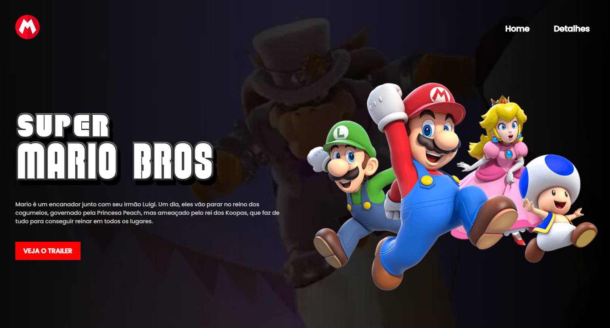

# Projeto Mario - Dev em dobro Landing page

Projeto realizado durante a semana de lives do canal de Youtube Dev em dobro. Nesse projeto pude aprender como aplicar um vídeo de fundo na página sobreposto por um gradiente e como fazer um modal.

  

## Tecnologias

Esse projeto foi desenvolvido com as seguintes tecnologias:

- HTML e CSS
- JavaScript
- Git e Github
